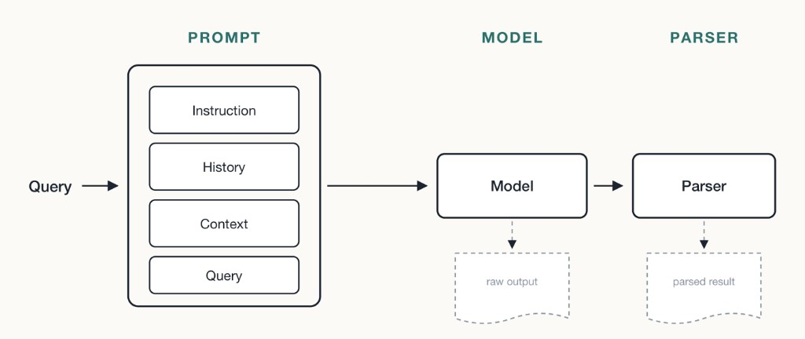

# AI Agent와 LangChain 기초

> 원본 코드: [`agent.py`](agent.py)

## AI Agent란

<div class="til-code" markdown>
```python
# 목표를 이해하고, 그에 맞는 계획을 세우고, 실행하는 AI 시스템.
# 관찰 → 계획 → 행동(tool 실행) 의 순환으로 움직인다. (ReAct 패턴)
# 도구를 쓴 결과를 다시 관찰해서 다음 행동을 정한다는 점이 한 번 답하고 끝나는 챗봇과의 차이.
```
</div>

## 모델에는 메모리가 없다

모델은 문장이 들어오면 문장을 내보내는 함수일 뿐이다.<br>안에 상태를 저장할 메모리가 없어서 호출할 때마다 늘 처음 만나는 상태다.

!!! warning
    아래 세 가지가 전부 여기서 따라 나온다. 모델이 `stateless` 라서 결국 다 프롬프트에 넣는 문제가 된다.  
    `대화 기억`  → 프롬프트에 Instruction + History + Query 를 매번 다시 넣는다  
    `환각 방지`  → 근거가 될 context 를 프롬프트에 같이 넣는다  
    `agent 최적화` → 모델 학습은 오래 걸리니, 현실적인 핵심은 프롬프트를 정교하게 만드는 것  
    우리가 모델에 간섭할 수 있는 통로는 `프롬프트`뿐이다.

## 프롬프트의 4가지 구성 요소

모델에 보내는 것은 결국 문자열 하나다. 그 안에 아래 4가지 덩어리를 순서대로 넣는다.

<div class="til-code" markdown>
```python hl_lines="1 3 5 7"
 [Instruction] 너는 사내 규정을 안내하는 상담원이다. 모르면 모른다고 답한다.

 [Context] (사규 문서에서 찾아온 관련 조항 원문)

 [History] user: 연차 며칠 쓸 수 있나요? / ai: 연 15일입니다.

 [Query] 그럼 반차도 되나요?
```
<div class="til-note" data-til-line="1" hidden>모델의 역할과 지켜야 할 규칙. 출력 형식·말투·금지사항도 여기<br>질문이 바뀌어도 거의 그대로 반복되는 고정 부분 (system 메시지에 해당)</div>
<div class="til-note" data-til-line="3" hidden>이번 답변의 '근거 자료'. 밖에서 가져와 붙이는 부분<br>검색 결과·DB 조회·툴 실행 결과값이 여기 들어간다<br>모델이 모르는 최신 정보나 사내 정보를 알려주는 통로 → 환각 방지의 핵심</div>
<div class="til-note" data-til-line="5" hidden>지금까지 주고받은 대화 기록<br>모델에 메모리가 없어서 매번 통째로 다시 보내야 한다<br>이게 있어야 "그럼" "그거" 같은 말을 알아듣는다</div>
<div class="til-note" data-til-line="7" hidden>이번에 답해야 할 사용자 질문. 보통 맨 뒤에 둔다</div>
</div>

!!! warning
    Context 와 History 는 헷갈리기 쉽다.  
    History = 우리끼리 주고받은 말 · Context = 밖에서 가져온 자료.  
    History 는 대화를 이어가려고, Context 는 사실을 맞히려고 넣는다.

## Context window

<div class="til-code" markdown>
```python
# 모델이 한 번에 처리할 수 있는 토큰의 총량. 위 4가지를 다 넣은 입력과 생성할 출력이 여기에 함께 들어간다.
# 토큰은 글자보다 크고 단어보다 작은 단위이고, 한국어는 영어보다 같은 내용에 토큰을 더 많이 쓴다.
# 한도를 넘으면 에러가 나거나 앞부분이 잘려 나간다.
```
</div>

!!! warning
    부풀어 오르는 건 대부분 History 와 Context 다. Instruction 과 Query 는 짧다.  
    History → 오래된 건 요약하거나, 최근 몇 턴만 남긴다  
    Context → 문서를 통째로 넣지 말고 관련된 부분만 검색해서 넣는다 (RAG 가 하는 일)  
    출력 → 답변이 들어갈 자리도 남겨둬야 한다. 입력으로 다 채우면 답이 잘린다

## Tool(함수) 호출 흐름

<div class="til-code" markdown>
```python
# 1) LLM 이 입력을 받고 툴을 호출할지, 어떤 툴을 호출할지 판단한다.
# 2) 사용자 입력에서 함수의 인자로 넣을 값을 LLM 이 추출한다.
# 3) 툴(함수) 실행.
# 4) 결과를 다시 프롬프트에 넣어 LLM 이 최종 답변을 만든다.
```
</div>

## LLM 은 함수의 무엇을 보는가

<div class="til-code" markdown>
```python hl_lines="2 3 6"
# 함수 본문을 실행해보지 않는다. 이름 · docstring · 타입 힌트만 보고 판단한다.
# 그래서 툴은 "LLM 이 읽을 설명서" 라고 생각하고 써야 한다.
def get_weather(city: str) -> str:
    """도시 이름을 받아 현재 날씨를 반환한다."""

    return f'{city} 맑음'
```
<div class="til-note" data-til-line="3" hidden>함수명 — 무슨 일을 하는지 드러나게<br>타입 힌트 — 어떤 값을 넣어야 하는지<br>docstring — 언제 이 툴을 써야 하는지</div>
<div class="til-note" data-til-line="6" hidden>반환값도 결국 텍스트로 프롬프트에 들어가니 문자열 형태여야 한다</div>
</div>

!!! warning
    주석은 LLM 에게 전달되지 않는다.  
    설명은 반드시 docstring(함수 첫 줄의 """...""")에 쓴다.  
    docstring 은 실행 중에도 함수.__doc__ 으로 읽을 수 있어서 LangChain 이 이걸 꺼내 스키마로 만든다.

## LangChain — 체인 구성



<div class="til-code" markdown>
```python hl_lines="1"
 chain = prompt | model | parser
```
<div class="til-note" data-til-line="1" hidden>prompt : [Instruction·History·Context·Query] 를 하나의 입력 문장으로 조립<br>model  : (사용자 입력)문장을 받아 (사용자에게 보낼 답변)문장을 출력<br>parser : 출력 텍스트를 원하는 형태로 구조화</div>
</div>

!!! warning
    parser 가 필요한 이유는 모델 출력이 그냥 문자열이라 코드에서 바로 못 쓰기 때문이다.  
    Pydantic 모델을 지정하면 정해진 필드를 가진 객체로 변환해준다.  
    agent 에 넘기거나 다음 단계에서 값을 꺼내 쓰려면 이 과정이 필요하다.
