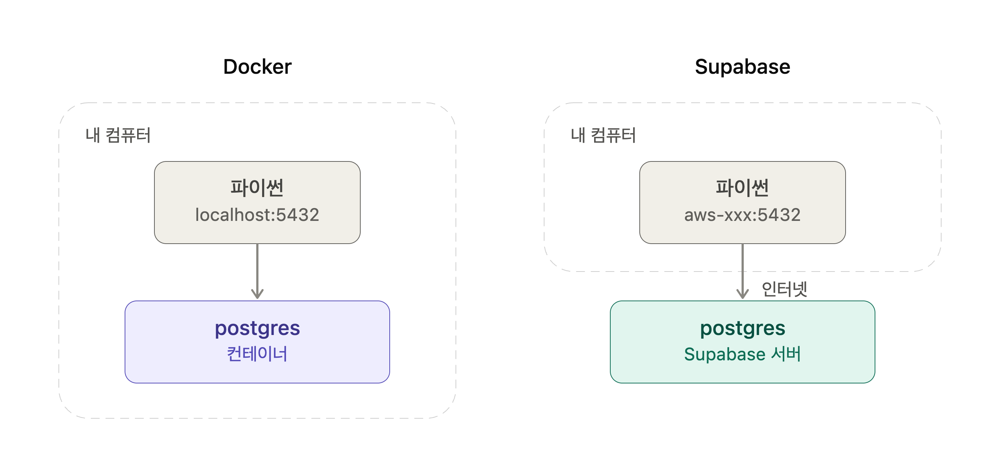
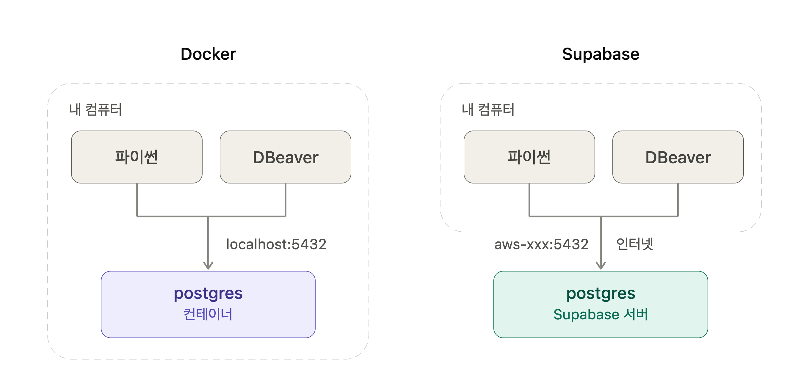

# PostgreSQL — psql 접속과 psycopg

> 원본 코드: [`02_docker_psql.py`](02_docker_psql.py)

## psql 옵션 — -c 와 -d

<div class="til-code" markdown>
```python
# -U  접속할 사용자 이름 (User)
# -d  접속할 데이터베이스 이름 (Database). 생략하면 사용자와 같은 이름으로 시도
# -c  명령 하나만 실행하고 바로 나옴 (Command)

docker exec db-pg psql -U postgres -d shop -c "SELECT version();"
```
</div>

!!! warning
    `docker run -d`  → detached. 백그라운드 실행  
    `psql -d`        → database. 어느 DB 에 붙을지  
    `-c` 를 쓰면 명령 하나 실행하고 끝남. 여러 개를 이어서 쓸 거면  
    `-it` 로 대화형 접속을 하는 게 편함 → `docker exec -it db-pg psql -U postgres`

## psql 백슬래시 명령

<div class="til-code" markdown>
```python
# -c 뒤에는 sql이 아닌 psql 단축 명령
docker exec db-pg psql -U postgres -c "\l"           # DB 목록
docker exec db-pg psql -U postgres -d shop -c "\dt"  # 테이블 목록
docker exec db-pg psql -U postgres -d shop -c "\d"   # 모든 객체 목록
docker exec db-pg psql -U postgres -d shop -c "\d books"  # books 표의 구조
```
</div>

!!! warning
    `\d` 와 `\dt` 가 다름.  
    `\dt` → 표만 3개 (members, books, rentals)  
    `\d`  → 6개. 시퀀스( books_id_seq …,)까지 같이 나옴  
    BIGSERIAL 이 자동으로 만드는 번호표 생성기가 시퀀스임. 그것도 객체라서 잡힘.


## Docker(postgres) VS Supabase(postgres)





!!! warning
    | 서버 쪽 (DB가 사는 곳) | 클라이언트 쪽 (접속하는 도구) |
    |---|---|
    | Docker의 postgres | DBeaver |
    | Supabase의 postgres | 파이썬 (psycopg) |
    | | psql (터미널) |

!!! warning
    | | Docker | Supabase | DBeaver |
    |---|---|---|---|
    | 정체 | DB 실행 환경 | DB 서비스 | DB 접속 도구 |
    | 역할 | 서버 | 서버 | 클라이언트 |
    | DB 위치 | 내 컴퓨터 | 인터넷 저편 | 없음 (DB가 아님) |
    | 주소 | `localhost` | `aws-xxx...` | 주소를 입력하는 쪽 |
    | 인터넷 | 필요 없음 | 필요함 | 접속 대상에 따라 다름 |
    | 내 컴 끄면 | DB도 꺼짐 | 계속 살아있음 | 프로그램만 꺼짐 (DB는 무관) |
    | 다른 사람과 공유 | 안 됨 | 됨 | 각자 설치해서 씀 |
    | 데이터 저장 | 함 | 함 | 안 함 |